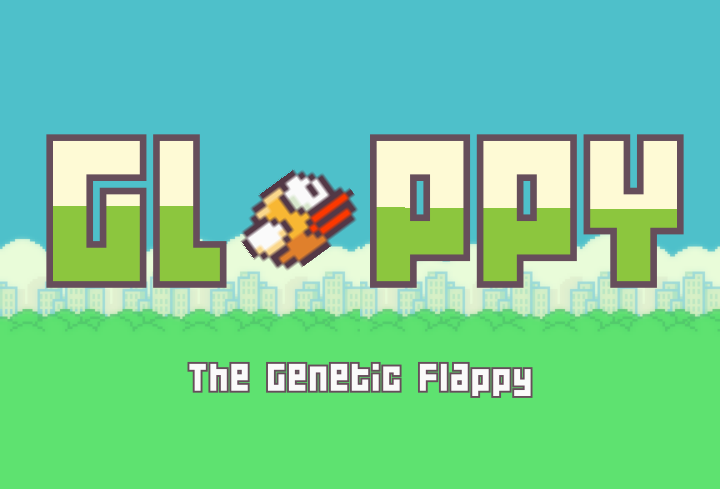

  

Author           : [MrRhuezzler](https://github.com/MrRhuezzler)  
Project Language : Python  
Project Year     : 2021  

## Short Description
Glappy is a simple neural network. The learning process is done using a genetic algorithm that produces a population of birds, selectes the best set of birds (more appropriate name would be genes), crosses two selected genes to produce children and mutates them. As the algorithm runs for many generations the best genes get evolved and produce better results. The best genes are selected by comparing the distance the particular bird has travelled, the bird which travelled the furthest is rewarded the most.
